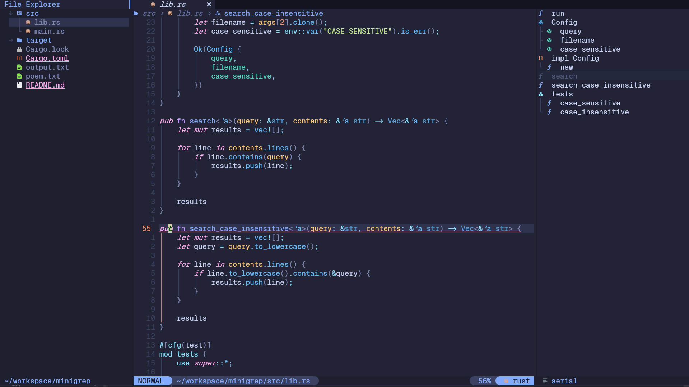
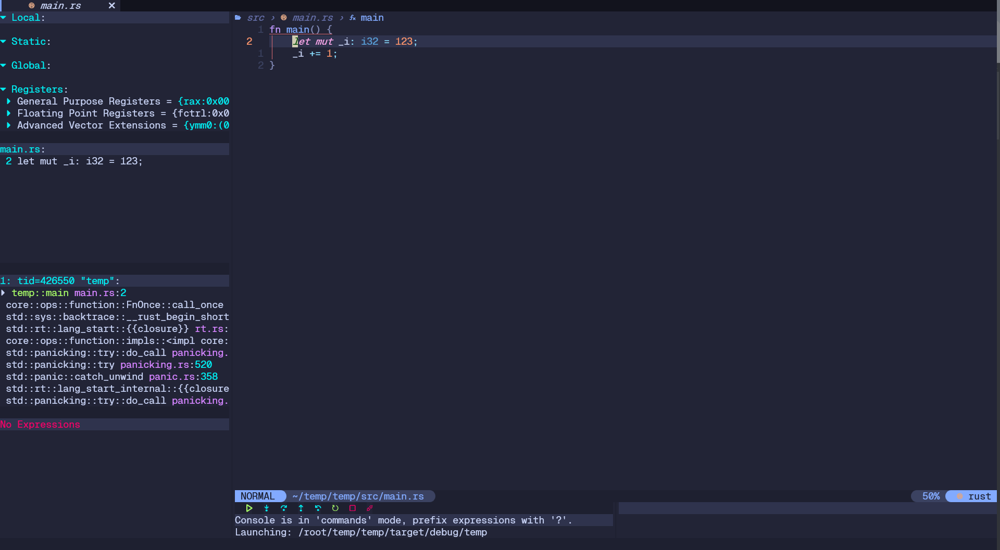
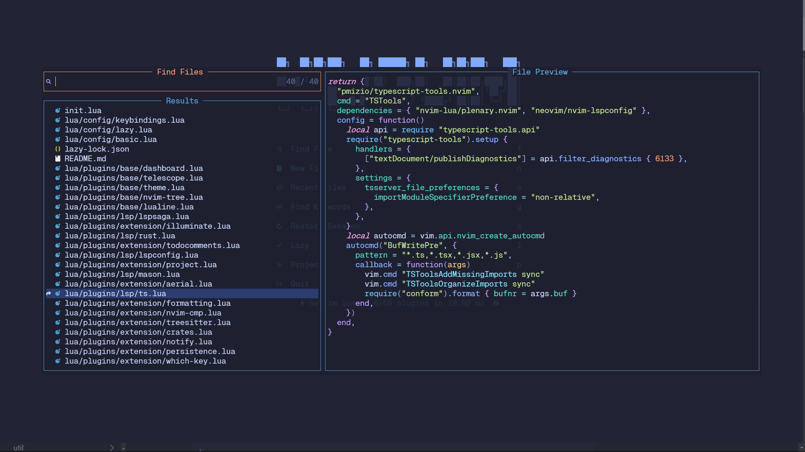
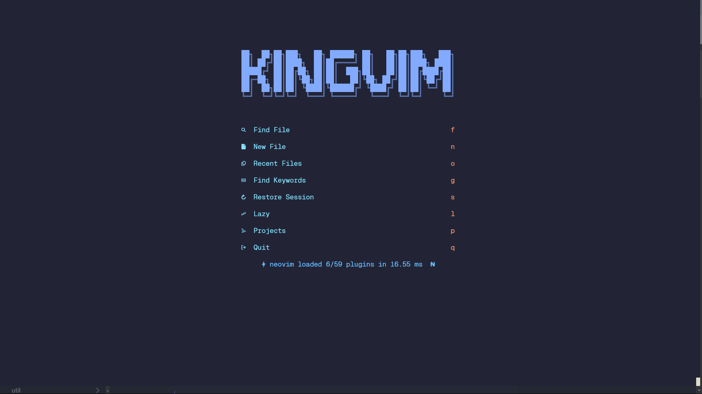

# 截图

# 依赖环境
- fzf 
- ripgrep 
- 剪贴板工具（xclip/xsel/win32yank 或其他取决于平台的工具）

# TODO: 
- 代码折叠
- 从nvim-cmp转blink.cmp 
- 不使用nvim-cmp 的话 autopairs 的依赖要改一下

# 编写Rust的vim简单配置 
- 配置文件 : .vimrc
- 需要下载vim-plug : https://github.com/junegunn/vim-plug
